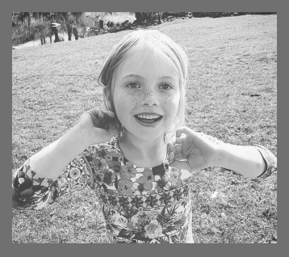
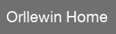

# LÖVE Home

A personal home launcher written in Love2D/LÖVE. 


## Instructions

Install Love etc etc, clone, open in Nova, run.

On first launch hit 's' to open the save directory and duplicate the following example in `config.lua`, note the separate type tables are being replaced by a common `views` table:

```
return {
	title = "Orllewin Home",
	background = "#547867",
	fullscreen = true,
	font = "HelveticaNeue.ttc",
	font_size = 22,
	views = {
		{"rect", 10, 10, 320, 280, nil, 4, "#ccddcc", "fill"},
		{"text", "Orllewin Home", 15, 15, "#1d1d1d"} ,
		{"rect", 1100, 15, 220, 100, 1, 4, "#eeffee"},
		{"image", "images/sp.png", 300, 10, 0.5},
		{"image", "images/a.png", 300, 400, 0.5},
		{"button", "Orllewin", 20, 50, 220, 40, "web", "https://orllewin.uk"},
		{"button", "Password", 20, 100, 220, 40, "copy", "secret_password"},
		{"image_button", "images/open_save_dir.png", 1395, 855, "config"},
		{"debug", 500, 10, "#ff00cc"}
	}
}
```

# Views

The available view types and their syntax.

## Button


"button" - String, the view type identifier  
label - String  
x - Int  
y - Int  
width - Int  
height - Int  
actionType - String, "web", "action", "copy", "config" 
payload - String, a URL, shell command, or something to copy to the system clipboard. Not needed for actionType "config"

Example:  
```
{"button", "Orllewin", 10, 40, 120, 40, "web", "https://orllewin.uk"}
```

## ImageButton

"image_button" - String, the view type identifier  
path - String, path to image
x - Int  
y - Int  
actionType - String, "web", "action", "copy", "config" 
payload - String, a URL, shell command, or something to copy to the system clipboard. Not needed for actionType "config"

Example
```
{"image_button", "images/open_save_dir.png", 1395, 855, "config"}
```

## Image



"image" - String, the view type identifier  
path - String, path to image in home directory   
x - Int  
y - Int  
scale - float. 1 is original size, 0.5 is half.

Example:
```
{"image", "images/sp.png", 300, 10, 0.5},
```

## Text



A simple label.

"text" - String, the view type identifier  
label - String   
x - Int  
y - Int  
colour - Hex colour String, eg. "#112233"  

Example:
```
{"text", "Orllewin Home", 650, 500, "#1d1d1d"}
```

## Rect


A border used to group a collection of views.

"rect" - String, the view type identifier  
x - Int  
y - Int   
width - Int  
height - Int  
lineWidth - Int   
cornerRadius - Int   
colour - Hex colour String, eg. "#112233" 
drawType - String, "fill" or "stroke", if "fill" lineWidth is ignored

Example: 
```
{"rect", 645, 5, 180, 280, 1, 3, "#eeffee", "stroke"}
```


