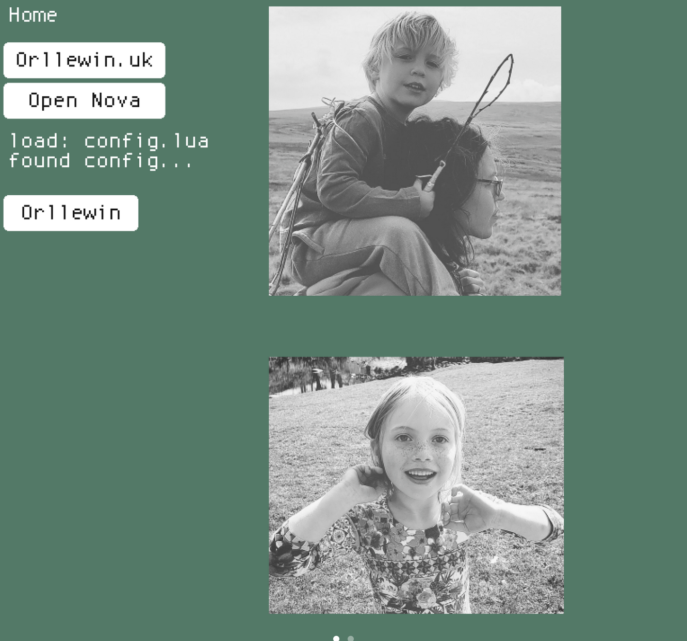

# LÖVE Home

A personal home launcher written in Love2D/LÖVE. 



## Instructions

Install Love etc etc, clone, open in Nova, run.

On first launch hit 's' to open the save directory and duplicate the following example in `config.lua`:

```
return {
	title = "Orllewin Home",
	background = "#547867",
	fullscreen = true,
	buttons = {
		--title, x, y, width, height, type, url/action
		{"Orllewin", 80, 240, 150, 40, "web", "https://orllewin.uk"},
		{"Merveilles", 80, 285, 150, 40, "web", "https://merveilles.town/home"}
	},
	images = {
		--path, x, y, scale
		{"images/sp.png", 300, 10, 0.5},
		{"images/a.png", 300, 400, 0.5}
	},
	text = {
		--text, x, y
		{"Hello, World!", 500, 500}
	}
}
```